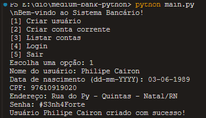
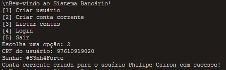
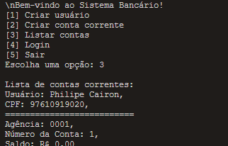
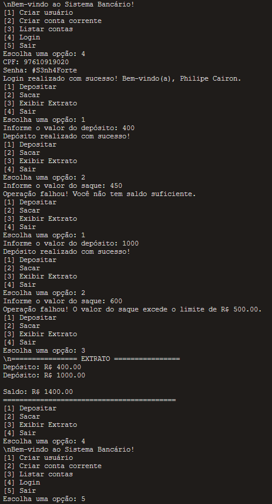

# Projeto de Sistema Bancário

Este projeto é um sistema bancário simples que permite aos usuários realizar operações bancárias básicas.

## Fluxograma

1. Iniciar o programa
2. Criar um usuário
3. Criar uma conta
4. Fazer login
5. Executar as operações
6. Verificar a conta

### Iniciar o programa:

Digite no terminal, na raiz do projeto: `python main.py`

### Crie um usuário:

Para criar um usuário usando a classe Usuario, você precisa fornecer os seguintes dados:

- `Nome:` O nome do usuário como uma string.
- `Data de Nascimento:` A data de nascimento do usuário no formato ‘dd-mm-YYYY’. Por exemplo, ‘25-12-1990’.
- `CPF:` O CPF do usuário como uma string contendo exatamente 11 dígitos. Por exemplo, ‘12345678901’.
- `Endereço:` O endereço do usuário como uma string.
- `Senha:` A senha do usuário como uma string. A senha deve ter pelo menos 8 caracteres e incluir pelo menos uma letra minúscula, uma letra maiúscula, um dígito e um caractere especial (@, $, !, %, \*, ?, &, #).

### Criar uma conta / Fazer login:

Para criar uma conta só é preciso do `CPF` e da `Senha`:

## Métodos

- Depositar
- Sacar
- Exibir extrato

## Regras

- Não é possível sacar mais que R$ 500 reais

## Prints

- Cadastro

- Criar conta corrente

- Listar contas

- Realizando operações

